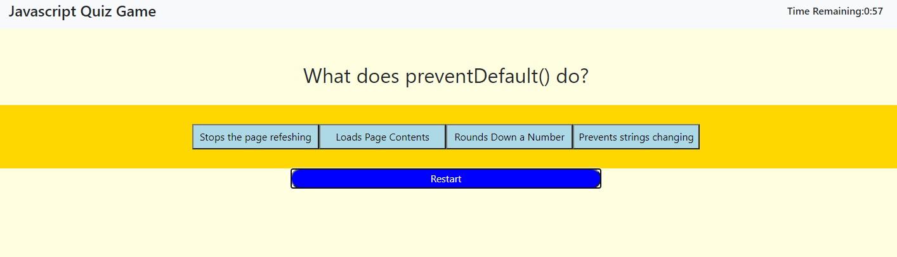
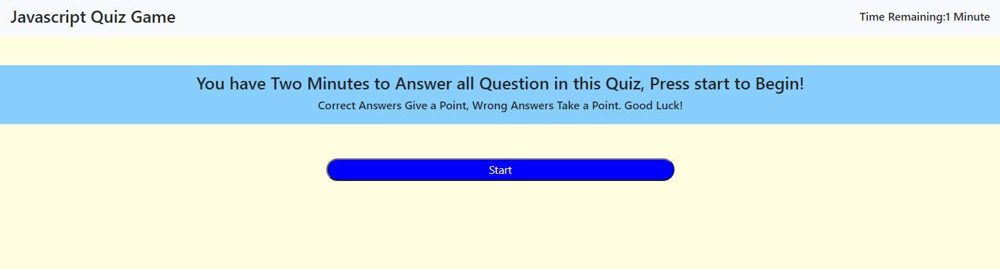
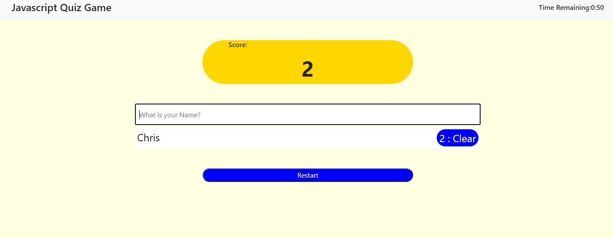

# JavaScript Quiz&middot;  

## Deployed Site

Deployed URL : https://chrisamk.github.io/JavaScript-Quiz-Game/

Github Link : https://github.com/ChrisAMK/JavaScript-Quiz-Game

## Description 
For this Project we were to build a Javascript quiz game to check compare our knowledge against others in the class, it was to be displayed on a HTML Page, styled with CSS and given functionality through JavaScript. For my quiz i wanted to have a quiz where the user could select the button and then click to the next question, upon reading the read me just then i realized it was a fatal error. It still works but it isn't what is asked for, the thing i most liked about my quiz are the shuffled questions so every time the quiz starts it is in a random order. im happy with out the quiz works apart from saving the highscores to the Local Storage, i couldn't get multiple key values to stay.

## Table of Contents 
* [Installation](#Installation)
* [Usage](#Usage)
* [License](#License)
* [Contributions](#Contributions)
* [Tests and Examples](#Tests)
* [Questions](#Questions)

## Installation  
No installation required, just click the provided link above

## Usage  
to test the user's knowledge of JavaScript

## License  
Academic Free License v3.0

[Click Here to go to License Site!](https://opensource.org/licenses/AFL-3.0)

## Tests and Examples  
User is given a question on JavaScript and has the choice of 4 answers

## Questions  
If there are any questions feel free to reach me at [Github](https://github.com/ChrisAMK)

or E-mail me at chriskl@live.com

